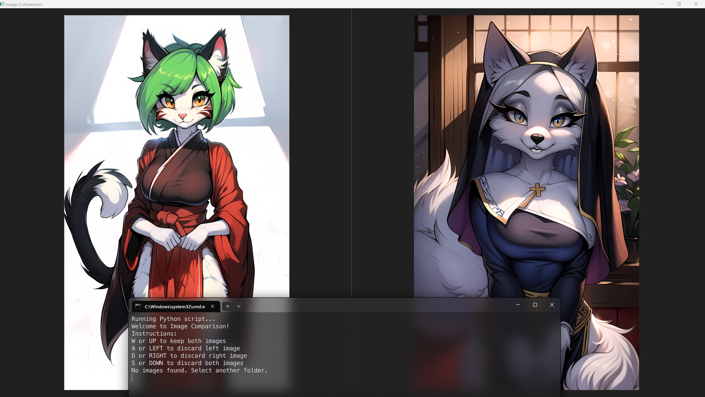

# image-comparison


This script is mostly written by OpenAI ChatGPT. It works, at least on my PC.  
This script is displaying random images from the target folder with minimal UI.  
You're able to ```discard``` images you don't want.

You can download the script in your Terminal:
```
git clone https://github.com/AyoKeito/image-comparison
```  
Or you can download a zip archive from ```Releases```

Discarded images are **moved** to ```discarded``` subfolder. Nothing is deleted.  
To discard an image, press:  
```A``` or ```Left Arrow``` to discard image displayed on the left.  
```D``` or ```Right Arrow``` to discard image displayed on the right.  
```W``` or ```Up Arrow``` to keep both images displayed and discard none of them.  
```S``` or ```Down Arrow``` to discard both images displayed.  

The loop will continue, until only 2 images are left in the target folder, or application window is closed.  
All file operations are logged into the terminal.

## Main script is batch_sorter.py:
```
usage: batch_sorter.py FOLDER_PATH
```
batch_sorter.py can be run from the terminal directly. It accepts folder path as an optional argument.  
If no folder path is provided, or provided path contains no images, a file dialog will appear to select the folder you want.  
There are no other flags or arguments to use.  
All errors are logged into ```error.log```

## batch_sorter.bat is also included to simplify running the program under Windows:
If needed, it creates a venv in the program's folder, installing ```pillow``` and ```pyqt5```  
After that, it simply runs the script using this venv.
